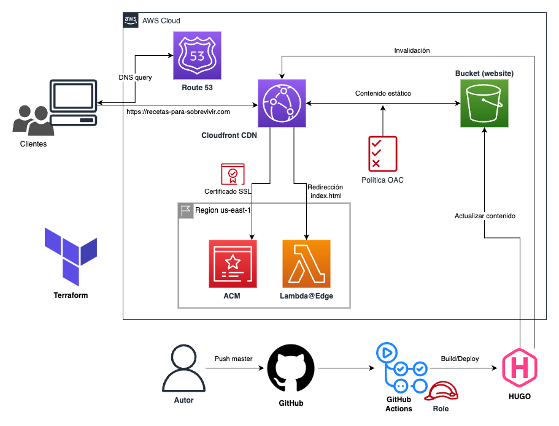

# Blog "Recetas Para Sobrevivir"

Este blog surge como idea para guardar, a modo de recopilatorio, todas aquellas recetas que me han salvado de un apuro.
Son recetas fáciles, rápidas y deliciosas! Todo lo que una persona recién independizada necesita para sobrevivir.

Se puede visitar desde la siguiente **URL** -> https://recetas-para-sobrevivir.com

## Infraestructura

Por supuesto, no todo es el contenido, sino que también es importante saber lo que hay detrás. Lo que complementa la idea de este blog,
es mi afán por aprender a diseñar y desplegar infraestructura en la nube (concretamente en **AWS**). 

La arquitectura sigue un patrón muy común para este tipo de casos: página web con contenido estático. Dicho contenido se aloja en un bucket S3 y se utiliza una distribución de Cloudfront para que pueda ser accedido más rápido desde cualquier lugar. A eso se ha añadido un dominio propio comprado desde Route53, certificado SSL a través de ACM y una Lambda@Edge dado el caso especial de las redirecciones que genera HUGO, el generador de las páginas estáticas.

Todo el aprovisionamiento de la infraestructura se ha realizado con Terraform. Notas a destacar:

- Los certificados y lambdas relacionadas con Cloudfront deben ser desplegadas obligatoriamente en la región `us-east-1`
- La validación de los certificados suele tardar bastante, por lo que Terraform puede dar fallos de `time-out`.
- Existen dos métodos para garantizar acceso entre Cloudfront y S3, se ha optado por la más sencilla **OAC** (Origin Access Control)
- Para garantizar la conexión entre GitHub Actions y AWS, se necesita configurar **OpenID Connect** con un rol específico al que también se ha aplicado la *ley de permisos mínimos*.

## Web

Para la página web se ha optado por usar HUGO, un generador de páginas estáticas muy ligero, junto con Bulma CSS para la creación de las plantillas. Al no ser la parte más importante de este proyecto, las vistas no están del todo optimizadas para cualquier dispositivo. Lo recomendable es visitarla desde dispositivos con pantalla grande.

Notas a destacar:

- Para no depender de otros CDNs se ha optado por descargar versiones mínimas de dependencias para elementos CSS, tanto como para Bulma como para los iconos de FontAwesome.
- La propia configuración de HUGO permite realizar el `deploy` al bucket S3 y también las invalidaciones de Cloudfront, lo cual simplifica bastante el proceso.

## Referencias

Como para cualquier proyecto, se ha necesitado buscar información acerca de cómo funcionan cada una de las partes. Se han tomado las siguientes referencias:

- [ Lambda redireccion index.html ](https://aws.amazon.com/es/blogs/compute/implementing-default-directory-indexes-in-amazon-s3-backed-amazon-cloudfront-origins-using-lambdaedge/)

- [Inspiración tema de plantillas](https://github.com/rametta/recipe-book)

- [GitHub Actions](https://capgemini.github.io/development/Using-GitHub-Actions-and-Hugo-Deploy-to-Deploy-to-AWS/)